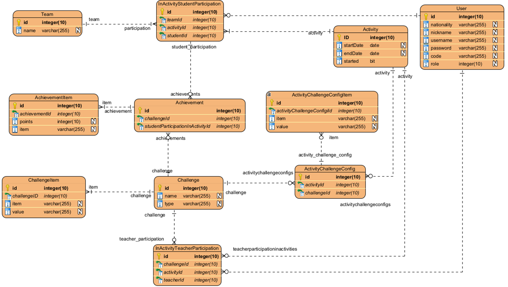
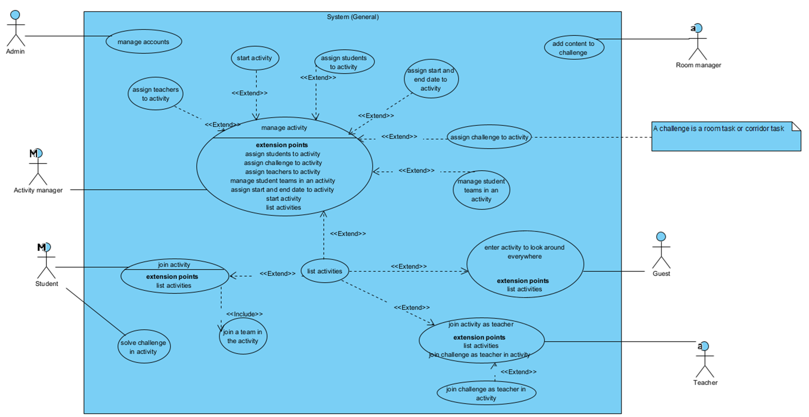

# XREATE digital security training lab

This project is a first draft for a training lab in the XREATE project.

At this moment only the backend is available.

## Getting Started

Clone this respository.

```
git clone https://github.com/tcrurav/xreate.git
```

create a backend/.env file for the backend. This is an example:

```
JWT_SECRET=V3RY#1MP0RT@NT$3CR3T#

MYSQL_DATABASE=db_xreate_dev
MYSQL_USER=root
MYSQL_PASSWORD=sasa
MYSQL_ROOT_PASSWORD=sasa

ADMIN_USER=admin
ADMIN_PASSWORD=sasa

DB_HOST=localhost
PORT=8080

NODE_ENV=development
```

Create the database ```db_xreate_dev``` in your MySQL Server.

Install dependencies and run the backend:

```
cd backend
npm install
node server.js
```

In a new console execute the seeders for the backend:

```
cd backend
npx sequelize-cli db:seed:all
```

Enjoy!

## Postman
* You can import the following Postman end-points and environment to try the backend: 
  - [postman collection](postman/xreate.postman_collection.json).
  - [postman environment](postman/metaverse.postman_environment.json).
* You can also access de postman end-points online: 
  - [postman collection online](https://documenter.getpostman.com/view/3446841/2sAYBPmZqP).

## Prerequisites

All you need is... some time and...
* Visual Studio Code.
* Git.
* MySQL Server.
* More hours than you first could think of...

## Entity Relationship diagram


## General Use Case diagram


## Built With

* [Visual Studio Code](https://code.visualstudio.com/) - The Editor used in this project

## IES El Rincón students working on the project

At the moment 6 students are willing to work on the project.

students will work by pairs developing one scene each team.

## Acknowledgments

* https://gist.github.com/PurpleBooth/109311bb0361f32d87a2. A very complete template for README.md files.
* https://sequelize.org/docs/v6/other-topics/migrations/. Sequelize link to read about seeders.