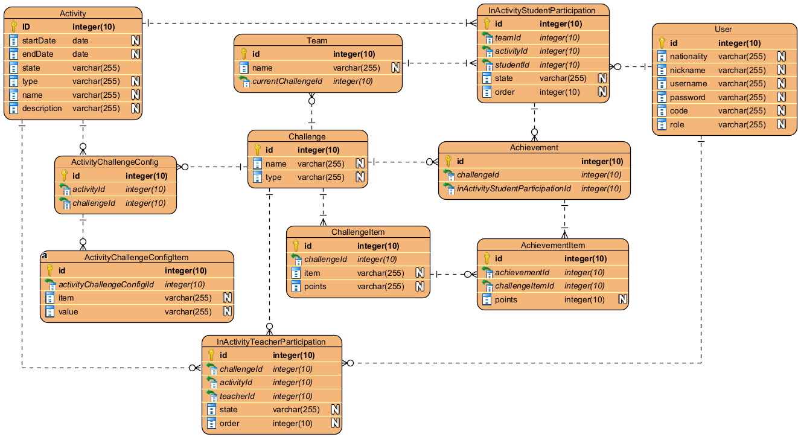
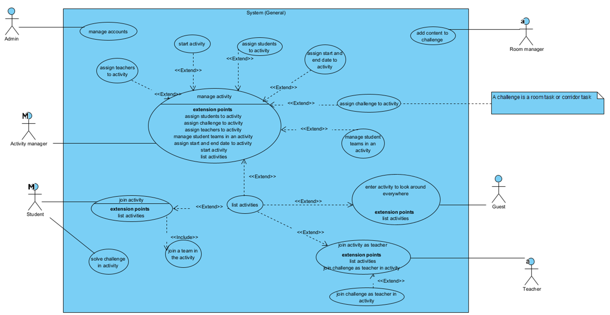

# XREATE digital security training lab
[](README.md)
<!-- [](README.es.md) -->

This project is a first draft for a training lab in the XREATE project.

At this moment 
  - Backend is working.
  - Unity frontend has right now:
      * a working login
      * after a student logs in he/she can see his/her learning path.
      * students can enter the digital security training lab and visit room B.

[Read more about XREATE](docs/xreate-project-description.en.md)

## Getting Started

Clone this respository.

```
git clone https://github.com/tcrurav/xreate.git
```

* In the backend:

create a backend/.env file for the backend. This is an example:

```
JWT_SECRET=V3RY#1MP0RT@NT$3CR3T#

MYSQL_DATABASE_DEV=db_xreate_dev
MYSQL_USER_DEV=root
MYSQL_PASSWORD_DEV=sasa
MYSQL_ROOT_PASSWORD_DEV=sasa

MYSQL_DATABASE_TEST=db_xreate_test
MYSQL_USER_TEST=root
MYSQL_PASSWORD_TEST=sasa
MYSQL_ROOT_PASSWORD_TEST=sasa

MYSQL_DATABASE=db_xreate
MYSQL_USER=xreate
MYSQL_PASSWORD=verysecurepassword1
MYSQL_ROOT_PASSWORD=verysecurepassword2

ADMIN_USER=admin
ADMIN_PASSWORD=sasa

DB_HOST=localhost
PORT=80

NODE_ENV=development
```

Change the directory to the backend and Install dependencies:

```
cd backend
npm install
```

Reset the database and run the backend:

```
npm run db:reset
npm start
```

**IMPORTANT:** after the initial installation just use ```npm start``` to start the backend. The command ````npm run db:reset```` will **RESET** the Database and all data will be **DELETED**.

* In the frontend (Unity):

Download the 3 folders in this Google drive folder (https://drive.google.com/drive/u/0/folders/1cQXp--uMSGzDGwSNyM7TaGHgkyqevYjI) and place them into frontend/Assets as indicated below:

````
Assets/
├── VRMPAssets [Download from shared folder]
├── XREATE/
    ├── ReferenceMainScene/
    │   ├── ReferenceStation (Full Spaceship Prefab - Don't touch)
    ├── Scenes/
    │   ├── Corridors/
    │   ├── MainHub/
    │   ├── ScapeRooms/
    │   │   ├── LeisureModule
    │   │   ├── RoomModuleA
    │   │   └── RoomModuleB
    │   └── LoginScene
    ├── SharedAssets/
    │   ├── CommonPrefabs/
    │   │   ├── Aliens [Download from shared folder]
    │   │   ├── PREFAB
    │   │   ├── TEST   [Download from shared folder]
    │   ├── Materials/
    │   └── Scripts/
    └── TeamWorkspaces/
        ├── LeisureModuleTeam/
        ├── RoomModuleATeam/
        └── RoomModuleBTeam/
````

Now you can open the frontend project with Unity.

To run the unity project first open additively the following scenes:
* LoginScene
* MenuScene
* MainScene
* RoomModuleBScene


Enjoy!

## ALTERNATIVE: Run the backend with docker

You need a local environment with docker.

In Ubuntu 24.04 LTS Desktop in a fresh installation it worked for me with the following instructions: https://docs.docker.com/engine/install/ubuntu/#install-using-the-repository

Once you have your docker environment ready clone the project:

````
git clone https://github.com/tcrurav/xreate.git
````

Create a .env file from the .env.example, and modify it according to the comments:

````
cd backend
cp .env.example .env
````

**ATTENTION:** Line 19 in file backend/dockerfile will delete all data in API database.

Uncomment line 19 and comment line 22 in file backend/dockerfile. Then run from the project root directory the following command:

````
sudo docker compose up
````

Your API should be working. Now try your API:

````
curl http://localhost
````

**IMPORTANT:** Now comment Line 19 in file backend/dockerfile to avoid unintentional reset of the database.

Enjoy!

## Test the backend

Jest has been used for testing the backend. At the moment there are tests for the users end-points. To run the tests just run the following commands:

````
cd backend
npm test
````

## Postman
* You can import the following Postman end-points and environment to try the backend: 
  - [postman collection](postman/xreate.postman_collection.json).
  - [postman environment](postman/metaverse.postman_environment.json).
* You can also access de postman end-points online: 
  - [postman collection online](https://documenter.getpostman.com/view/3446841/2sAYBPmZqP).

## Prerequisites

All you need is... some time and...
* Visual Studio Code.
* Git.
* MySQL Server.

## Entity Relationship diagram


## General Use Case diagram


## Some definitions

* **Learning path**. It's the set of activities that a student has to fullfill to obtain a certificate.
* **Activity**. There are right now 3 types of activities: TRAINING_LAB, ASSET_LAB and VIRTUAL_CLASSROOM. A TRAINING_LAB activity is a set of students and teachers who work on a scaperoom activity made of a set of challenges. The activity has a start and an end date. 
* **Challenge**. A challenge can be either a room or a corridor task.
* **Team**. A team is a set of students playing together against other student teams.
* **Achievement**. An achievement is the result of the challenge for a student. The achievement can be divided into achievement items. For example in a scene a student X could have a total achievement of 11 points. This achievement could be devided in 5 achievement items: 3 card pairs guessed which means 5 points each, and 2 minutes of thinking time in his turns which means -2 points each. The total achievement for this student X in this challenge would be 3 x 5 – 2 x 2 = 11 points.
* **Team Achievement**. It’s the sum of team members achievements.

## Role descriptions

* **Admin**. Manages accounts. CRUD of accounts. CRUD means Create, Read, Update and Delete.
* **Activity Manager**. Manages activities. An activity is a set of students and teachers who work on a scaperoom activity made of a set of challenges. The activity has a start and end date. The activity manager can manage a CRUD of activities, adding teachers, students and challenges (rooms or corridors). An activity manager says when the activity starts and finishes.
* **Student**. uses a code to join an activity. Once joined can change his nickname and join a team. Students also solve the challenges (rooms or corridor tasks) together with his team.
* **Teacher**. join as a teacher in an activity using his code. Join challenge tasks for teachers.
* **Guest**. joins as guest in an activity using his code. Guests can go anywhere and observe everything.
* **Room manager**. can enter room data like questions, complexity of scene tasks, etc.

## Project Roadmap

* **March 2025**: A prototype will be tested in Newcastle college. 2 students from each of the 5 country project member schools will test the protype. At that moment only Student, Teacher and Guest roles will be able to login and use the App. The student's learning path will contain only a training lab about "digital security". Students will also be able to visit the VIRTUAL_CLASSROOM and the ASSET_LAB. At the end of the learning path students will be able to request his/her certificate.

## IES El Rincón students working on the project

At the moment 7 students are working on the project. Students will work in 3 teams developing one scene each team.

## Built With

* [Visual Studio Code](https://code.visualstudio.com/) - The Editor used in this project.
* [Express](https://code.visualstudio.com/) - Fast, unopinionated, minimalist web framework for Node.js.
* [Sequelize](https://sequelize.org/) - Sequelize is a modern TypeScript and Node.js ORM.
* [Unity](https://unity.com/) - Unity is a cross-platform 2D and 3D graphics engine.
* [Mixamo](https://www.mixamo.com/) - To create 3D characters, skeletal rigs, and animations, ready for use in film, games, interactive experiences and illustration.
* [Jest](https://jestjs.io/) - Jest is a delightful JavaScript Testing Framework with a focus on simplicity.
* [supertest](https://github.com/ladjs/supertest) - provides a high-level abstraction for testing HTTP. It has been used together with Jest to test the backend.
* [EJS](https://ejs.co/) - Embedded JavaScript templating. View templating used in the project.

## Acknowledgments

* https://gist.github.com/PurpleBooth/109311bb0361f32d87a2. A very complete template for README.md files.
* https://sequelize.org/docs/v6/other-topics/migrations/. Sequelize link to read about seeders.
* https://github.com/tcrurav/UnityWebRequestExpressSequelize. Example project that shows a Unity CRUD consuming an API with Express + Sequelize + MySQL.
* https://www.youtube.com/watch?v=76Lh0UApjNI. Excellent youtube explaining how to animate mixamo .fbx characters in Unity.
* https://codefile.io/f/uoiynHl2ZS. Data sharing among scenes.
* https://learn.unity.com/tutorial/como-implementar-la-continuacion-de-datos-entre-escenas?language=es#. Data sharing among scenes.
* https://www.youtube.com/watch?v=JZCzJyAbKwc. How to apply Transparent PNG Textures in Unity.
* https://discussions.unity.com/t/how-to-find-an-inactive-game-object/129521. How to find an inactive gameobject.
* https://discussions.unity.com/t/how-to-create-ui-button-dynamically/621275/5. How to create UI Button dynamically.
* https://dev.to/lukekyl/testing-your-express-js-backend-server-3ae6. Testing your Express.js Backend Server.
* https://levelup.gitconnected.com/building-an-express-api-with-sequelize-cli-and-unit-testing-882c6875ed59. Building an Express API with Sequelize CLI and Unit Testing!
* https://stackoverflow.com/questions/14221579/how-do-i-add-comments-to-package-json-for-npm-install. How to add comments to package.json file.
