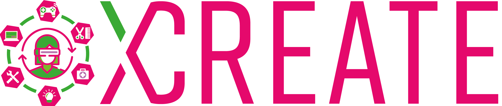

# XREATE Project Description

What is XREATE?
Teaching and Learning in the metaverse.

XREATE is a Project collaboration of 5 european schools with St. Gallen school as leader. The schools are:
* St. Gallen (Switzerland) - https://www.gbssg.ch/
* OSAO (Finnland) - https://www.osao.fi/en/
* Talland college (The Netherlands) - https://www.talland.nl/
* IES El Rincón (Gran Canaria) – https://www.ieselrincon.es
* Newcastle College (UK) - https://www.ncl-coll.ac.uk/

Together with the project partners, we will found and create with this project the first European VET school in the Metaverse and equip it with content and courses from common professional fields of our schools.